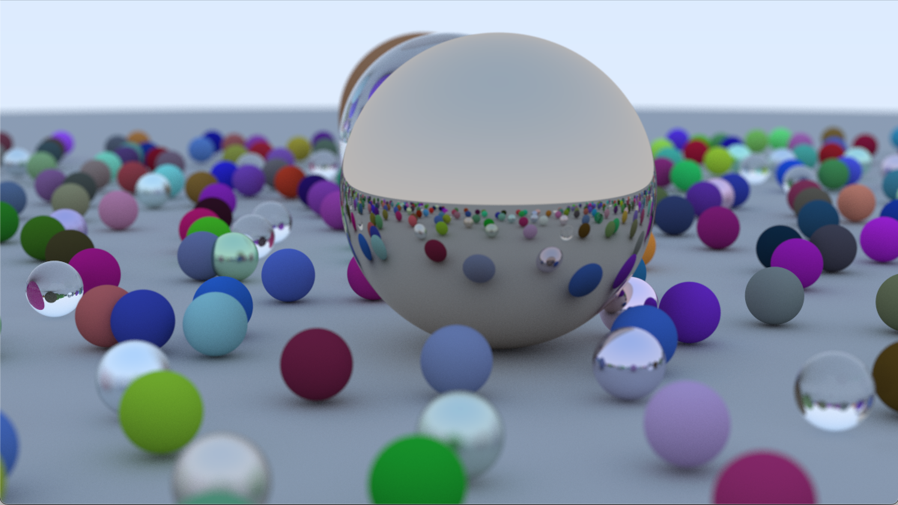

# From Static to Real-Time Ray Tracing

## https://youtu.be/_6R0r3gSDdM

---

---

* Partners' name
  * Team member 1: Calvin Fuller
  * Team member 2: Riccardo Prosdocimi
* External resources:
  * https://raytracing.github.io/books/RayTracingInOneWeekend.html
  * https://www.shadertoy.com/view/7tBXDh
  * https://stackoverflow.com/questions/39645910/how-to-port-shadertoy-to-standalone-opengl
